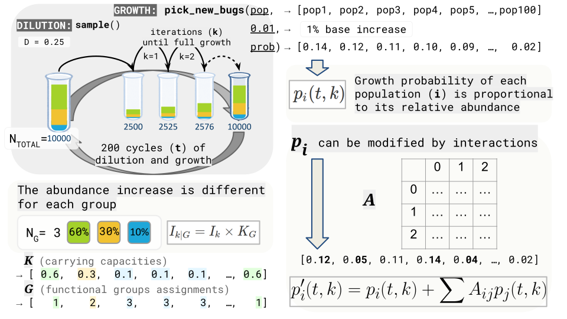

## predicting_fixation

Data and _scripts_ in this repository were used to elaborate original article "Computational simulation of ecological drift for generating minimal microbiomes identifies key experimental and biotic factors influencing success" ([preprint](https://doi.org/10.1101/2025.07.10.664178)).

### Summary
This pipeline generates models that are capable of predicting fixation of OTUs in a given community type or types from its **compositional data**. We establish successful fixation is reached when **only one OTU is present** in **each phylogenetic core group** (PCG) in **50%** or **90%** of the instances of that community.

Models are trained with dilution-growth experiment data. Once trained, these models are capable of predicting **how many transfers are needed** for fixation to occur in a new, dataset given information about its **composition** and **PCGs**.

Specifically, our objective is using these models to **identify useful parameters** for prediction of fixation. Being able to predict how many cycles we need for a given starting community will help us design dilution-growth experiments.

The pipeline consists of three main steps: (1) generation of initial communities, (2) simulation of dilution-growth cycles, and (3) analysis of fixation events.

### (1) Dataset generation

Our communities don't come from 16S sequencing, but have instead been **artificially generated with [this script](https://github.com/silvtal/predicting_fixation/blob/main/1_datasets/generate_simcomms.R)**. There's also a set of [artificially generated](https://github.com/silvtal/predicting_fixation/blob/main/1_datasets/generate_PCGtable.py) "PCG tables" that assign functional groups to the species in these simcomms.

In these datasets, each row corresponds to a microbial community that has been subjected to a dilution-growth experiment with a given dilution factor. The columns contain diversity metrics and other characteristics of our simcomms. There's also an additional column containing our target variable. The target variable is "successful fixation" - the number of dilution-growth cycles each community is expected to take until it reaches a state of successul fixation as defined above.

This target variable has been obtained from neutral simulations of growth-dilution experiments. The wrappers we used for running these simulations are in the `2_simulations/00_simulation_wrappers/` folder and use our [`dilgrowth` R package](https://github.com/silvtal/dilgrowth/). The results from these simulations (which output many folders containing multiple abundance data tables) were parsed into the final available .csv files with custom scripts available at the `2_simulations/02_process_results/` folder of this repository.

#### Dataset availability

The parsed datasets we have used are available [here](https://github.com/silvtal/predicting_fixation/tree/main/1_datasets/simulation_results).

There are two tables - one defines "success" (successful fixation) at a 50% threshold and the other defines it at a 90% threshold.

### (2) Simulation workflow structure

The `2_simulations/` directory is organized as follows:

- **`00_simulation_wrappers/`**: Contains wrappers and launch scripts:
  - **`wrapper_*.sh`**: Main simulation wrappers for each scenario:
    - `wrapper_scenario1.sh`: Scenario 1 (no functional groups)
    - `wrapper_scenario2.sh`: Scenario 2 (with functional groups)
    - `wrapper_scenario3.sh`: Scenario 3 (with functional groups and interactions)
    - `wrapper_rhizosphere.sh`: Real data from tomato rhizosphere
  - **`launch_*`**: Launch scripts that process simulation results:
    - `launch_create_data_simcomms`: Processes scenario 1 results
    - `launch_create_data_simcomms_groups`: Processes scenario 2 results
    - `launch_reorganizar_comunidades.sh`: Reorganizes community data

- **`01_scripts/`**: Contains the main simulation scripts:
  - `dilgrowth_1_2.R`: Used by scenarios 1 and 2
  - `simuls_3.R`: Used by scenario 3 (with interactions)

- **`02_process_results/`**: Contains scripts for processing simulation results:
  - `create_data_simcomms.R`: Main script for parsing simulation outputs
  - `simul_fixation_functions.R`: Helper functions for fixation analysis
  - `reorganizar_comunidades.py`: Python script for reorganizing community data

The workflow is: **Generate initial communities** (`1_datasets/`) → **Run simulations** (wrappers call scripts in `01_scripts/`) → **Process results** (launch scripts call scripts in `02_process_results/`)

### (3) Analysis

All analysis scripts can be found in [`3_analysis`](https://github.com/silvtal/predicting_fixation/tree/main/3_analysis):

- `S1_`: single-community simulations (scenario 1, no separate functional groups). Examples include `S1_0__plot_target_variable_space.py`, `S1_1__RF_success.R`, and `S1_2__GLM_failure.R`, which cover exploratory plots, random forest importance, and GLM failure probability, respectively.
- `S2_`: simulations with multiple functional groups (scenario 2). Representative scripts are the `S2_g_plot_results_facet_by_dil*.r` helpers that parse + plot preliminary results.
- `S3_`: simulations with multiple groups and including interactions (scenario 3). These are the `S3_1g-i__*` scripts focusing on exploring the effect of interactions on fixation, extinction and success.

Each script writes its outputs to the corresponding `figures*/` subfolder (`figures/`, `figures_groups/`, `figures_groups_INTERACTIONS/`), matching the scenario prefix.
